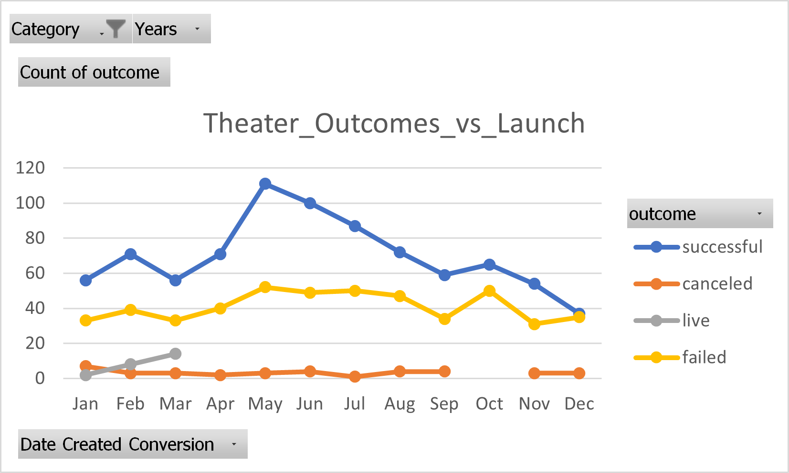
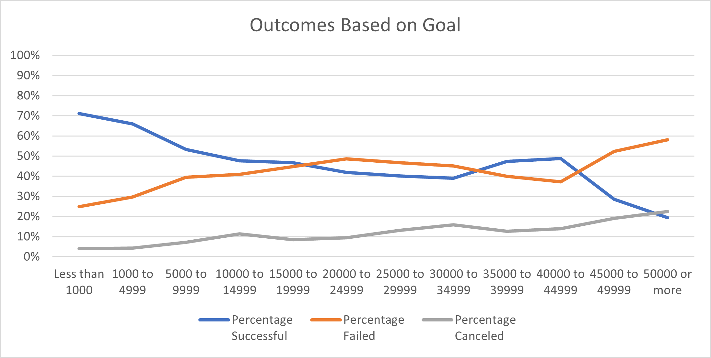

# Kickstarting with Excel

## Overview of Project

### Purpose
The purpose of the analysis is to discover the correlation between the outcomes and the 2 factors - launch date(Theater category) and set goal, and come up with a conclusion about in which month the campaigns tend to have better outcomes, as well as which goal range tends to get more successful outcomes.

## Analysis and Challenges

### Analysis of Outcomes Based on Launch Date
- Convert the "launched_at" date
  The "Launched_at" date shown in the worksheet is at Unix Timestamps format. By using =(((J2/60)/60)/24)+DATE(1970,1,1) formula, we can convert the unix timestamp format into readable mm/dd/yyyy format.

- Create pivot table to unveil the count of outcome by month
  Select the entire "Kickstarter" worksheet, and sort at the header and then create a pivot table. Select "Date_created_Conversion" into rows, "Outcome" into Columns, and Count of "Outcome" into Values. Also filter by Years and Parent Category, and filter Parent Category by "Theater"

- Create Pivot Chart through the Pivot Table
  By creating line pivot chart, we can get to see the difference of number of outcomes under each month in Theater category. Please see the chart below.

- Analysis
  Overall, we can see under Theater category, 839 campaigns are successful, 37 are canceled, 493 campaigns are failed, and 24 are still live. With outcome numbers varying from different launch months, we can see May and June tend to have more successful outcomes. Actually the number of campaigns in May and June outweighs the rest.
  On the other hand, There're more failed outcomes in May and October comparatively. But overall failed outcomes tend to have less correlation with launch date. 

### Analysis of Outcomes Based on Goals
- Categorized Goal
  To further analyze the correlation between the goal and outcomes, we categorize goal by every $5000. Then we use COUNTIFS(Kickstarter!$D:$D,"<1000",Kickstarter!$F:$F,"successful")) to get the counts of successful outcomes, failed outcomes, canceled outcomes under each goal range. 

- Understand the percentage of outcomes under each goal category
  To better represent the possibility of different outcomes, we use percentage. Divide count of successful outcomes, failed outcomes, canceled outcomes by the total campaign number. 

- Create Line chart
  Create a line chart and see the different percentage of successful outcomes, failed outcomes, canceled outcomes varying by different goal ranges. Please see the line chart below.

- Analysis
  From the line chart, we can see the percentage of successful outcomes tend to descrease with the increase of goal fund range, which means the higher the goals are, the less possible to get successful outcomes. On the other hand, we also see more canceled outcomes at the higher range of the goals. For those campaigns with failed outcomes also speak the same logic by showing more failed percetange at the higher goals(above $45000). However, overall the possibility of failed outcomes doesn't seem correlated with the value of the goals, as the line is less volatile before $45000.

### Challenges and Difficulties Encountered
- Using Countifs
  I know the formula countif, but cannot remember exactly how to use it properly. By reading the module and hint, finally I was able to get to the right direction. 

## Results

- What are two conclusions you can draw about the Outcomes based on Launch Date?
  Conclusion 1: The Theater campaigns launched in May and June tend to get successful outcomes.
  Conclusion 2: The Theater campaigns with failed outcomes have less correlation with the launch date.

- What can you conclude about the Outcomes based on Goals?
  Conclusion: The higher the campaign goals are set, the less possible to get successful outcomes

- What are some limitations of this dataset?
1. Live campaigns
  Some campaigns are still live and are not calculated into the outcomes.

2. Campaign topics
  If we can further categorize the campaigns by their topics, we can also analyze the outcomes by campaign topics.

- What are some other possible tables and/or graphs that we could create?
1. Boxplot Chart to analyze outcomes by goals
  Please refer to worksheet "Alternatives" in the excel file [Kickstarter_Challenge_Lucy Yuan](https://github.com/Ilylsh/kickstarter-analysis/blob/a80084e13e3c1d2960e9ceec81e6e0180701604f/Kickstarter_Challenge_Lucy%20Yuan.xlsx)
  Without reading the module, the first chart I thought of is boxplot chart. I also created the boxplot chart for goals with successful, failed and canceled outcomes and see the correlation between goals and outcomes.
  It may not be as clear as the line chart shows, but we can also tell the mean of the goals with successful outcomes is way lower than that with failed or canceled outcomes.
  Not only that, but intersting finding is that the mean of the goals with failed outcomes is even higher than its upper outlier, which I interpret that 25% of the goals which turn out to fail have dramatically high number set for the goals. 
  Another interesting finding by analyzing the standard deviation is that the difference between goal numbers of failed campaigns are very significant, which may require further analysis by category or subcategory, country,etc.
 